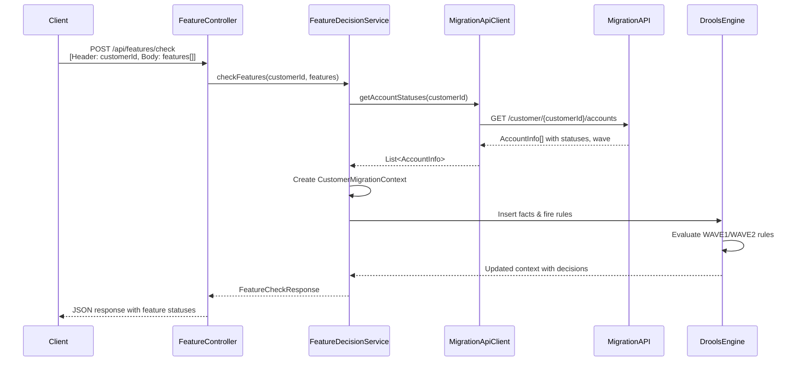

# Migration Feature Management Service

A Spring Boot service using Drools rules engine to manage feature flags during bank account migration from BankA to BankB.

## Overview

This service determines whether features should be enabled or disabled for customers during the migration weekend based on:
- Account types (savings, checking, CD, lending, IRA)
- Migration status (scheduled, in progress, migrated, excluded)
- Migration wave (WAVE1, WAVE2)

## Architecture

### Sequence Flow



## Migration Rules with Granular Feature Control

The system now supports **per-feature control**! Each feature (feature1, feature2, feature3, feature4) can be individually enabled or disabled.

### WAVE1
Migrates customers with (savings OR CD) WITHOUT checking accounts.

| Customer Accounts | Default Action | Customizable |
|------------------|----------------|--------------|
| Savings/CD only | All features disabled | ✅ Can enable specific features in Excel |
| Savings/CD + Checking | All features enabled | ✅ Can disable specific features in Excel |
| Savings/CD + Lending/IRA | All features disabled | ✅ Can enable specific features in Excel |

### WAVE2
Migrates customers with (savings OR CD) AND checking accounts.

| Customer Accounts | Default Action | Customizable |
|------------------|----------------|--------------|
| Savings/CD + Checking | All features disabled | ✅ Can enable specific features in Excel |
| Savings/CD + Checking + Lending/IRA | All features disabled | ✅ Can enable specific features in Excel |

### Example: Mixed Feature Access
You can configure rules like:
- feature1: disabled
- feature2: disabled
- feature3: enabled ← Different!
- feature4: disabled

### Account Types
- **SAVINGS** - Migrated in WAVE1 or WAVE2
- **CHECKING** - Migrated in WAVE2 only
- **CD** - Migrated in WAVE1 or WAVE2
- **LENDING** - Never migrated (EXCLUDED)
- **IRA** - Never migrated (EXCLUDED)

### Migration Statuses
- `NOT_MIGRATED` - Not scheduled for migration
- `EXCLUDED` - Never migrating (lending, IRA)
- `SCHEDULED` - Selected for migration
- `IN_PROGRESS` - Currently migrating
- `MIGRATED` - Already completed

## API Endpoints

### Check Features
Determines which features should be enabled for a customer.

**Endpoint:** `POST /api/features/check`

**Headers:**
```
customerId: {customer-id}
Content-Type: application/json
```

**Request Body:**
```json
{
  "features": ["feature1", "feature2", "feature3", "feature4"]
}
```

**Response:**
```json
{
  "customerId": "CUST123",
  "features": [
    {
      "feature": "feature1",
      "enabled": false,
      "reason": "WAVE1: feature1 disabled"
    },
    {
      "feature": "feature2",
      "enabled": false,
      "reason": "WAVE1: feature2 disabled"
    },
    {
      "feature": "feature3",
      "enabled": true,
      "reason": "WAVE1: feature3 enabled"
    },
    {
      "feature": "feature4",
      "enabled": false,
      "reason": "WAVE1: feature4 disabled"
    }
  ]
}
```

Note: Each feature can have a different status!

## Configuration

### application.yml
```yaml
migration:
  api:
    base-url: http://migration-api-server:9090
    endpoint: /api/customer/{customerId}/accounts
    timeout: 5000
```

### Environment Variables
- `MIGRATION_API_BASE_URL` - Base URL for the migration team's API

## Project Structure

```
src/main/
├── java/com/bank/migration/
│   ├── MigrationFeatureManagementApplication.java
│   ├── controller/
│   │   └── FeatureController.java
│   ├── service/
│   │   ├── FeatureDecisionService.java
│   │   └── MigrationApiClient.java
│   ├── model/
│   │   ├── dto/
│   │   │   ├── FeatureCheckRequest.java
│   │   │   ├── FeatureCheckResponse.java
│   │   │   └── FeatureStatus.java
│   │   ├── migration/
│   │   │   ├── MigrationApiResponse.java
│   │   │   ├── AccountInfo.java
│   │   │   ├── AccountType.java
│   │   │   ├── MigrationStatus.java
│   │   │   └── MigrationWave.java
│   │   └── rules/
│   │       └── CustomerMigrationContext.java
│   ├── config/
│   │   ├── MigrationApiConfig.java
│   │   └── DroolsConfig.java
│   └── exception/
│       ├── GlobalExceptionHandler.java
│       └── MigrationApiException.java
└── resources/
    ├── application.yml
    ├── META-INF/kmodule.xml
    └── rules/
        ├── migration-rules.xlsx          # Excel decision table (primary)
        └── migration-rules.csv            # CSV format (can be opened in Excel)
```

## Building and Running

### Prerequisites
- Java 17 or higher
- Maven 3.8+

### Build
```bash
mvn clean package
```

### Run
```bash
java -jar target/migration-feature-management-1.0.0-SNAPSHOT.jar
```

Or with Maven:
```bash
mvn spring-boot:run
```

### Configuration
Set the migration API base URL:
```bash
export MIGRATION_API_BASE_URL=http://migration-api-server:9090
java -jar target/migration-feature-management-1.0.0-SNAPSHOT.jar
```

## Testing with cURL

### Example 1: WAVE1 Customer with Savings Only
```bash
curl -X POST http://localhost:8080/api/features/check \
  -H "customerId: CUST001" \
  -H "Content-Type: application/json" \
  -d '{
    "features": ["feature1", "feature2", "feature3"]
  }'
```

### Example 2: WAVE1 Customer with Savings and Checking
```bash
curl -X POST http://localhost:8080/api/features/check \
  -H "customerId: CUST002" \
  -H "Content-Type: application/json" \
  -d '{
    "features": ["feature1", "feature2", "feature3", "feature4"]
  }'
```

## Health Check
```bash
curl http://localhost:8080/actuator/health
```

## Drools Rules Engine with Excel Decision Tables

The business logic is implemented in an **Excel decision table** (`src/main/resources/rules/migration-rules.xlsx`). This makes it easy for business users to view and modify rules without understanding Drools syntax.

The decision table evaluates:
- Customer account types
- Migration wave
- Account migration statuses

The rules engine updates the `CustomerMigrationContext` with feature decisions and reasons.

### Excel Decision Table Benefits
- ✅ **Business-Friendly** - Non-technical users can edit rules in Excel
- ✅ **Visual** - All rules visible in a single spreadsheet
- ✅ **Quick Updates** - Change rules without modifying code
- ✅ **Self-Documenting** - Rules are easy to understand
- ✅ **Granular Control** - Each feature can be independently enabled/disabled
- ✅ **Flexible** - Different rules can have different feature combinations

See `EXCEL_RULES_TEMPLATE.md` for detailed instructions and `GRANULAR_FEATURE_UPDATE.md` for per-feature control details.

## Error Handling

The service handles various error scenarios:
- **400 Bad Request** - Invalid request parameters or missing customerId
- **503 Service Unavailable** - Migration API unavailable or error
- **500 Internal Server Error** - Unexpected errors

Error responses include timestamp, status, error type, and descriptive message.

## Dependencies

- Spring Boot 3.2.0
- Drools 8.44.0.Final
- Lombok
- Spring Boot Actuator

## License

Internal use only - Bank Migration Project

